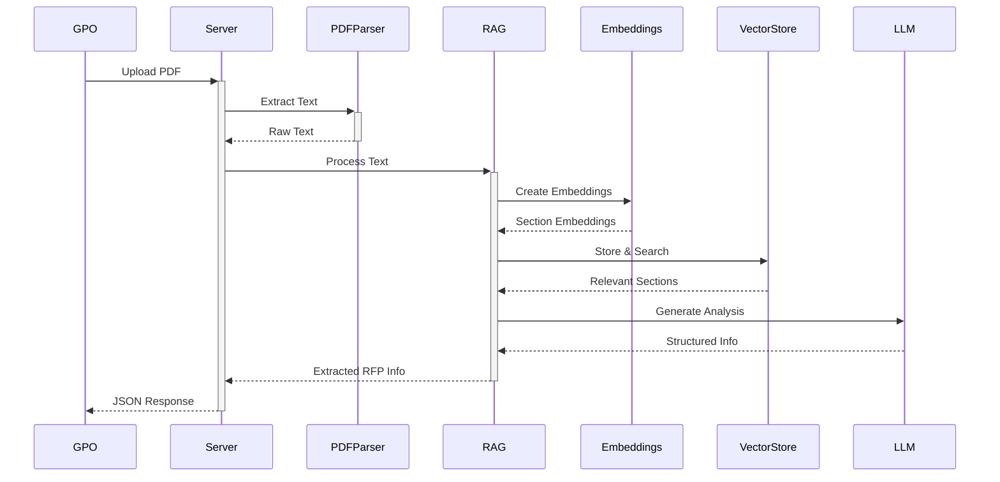
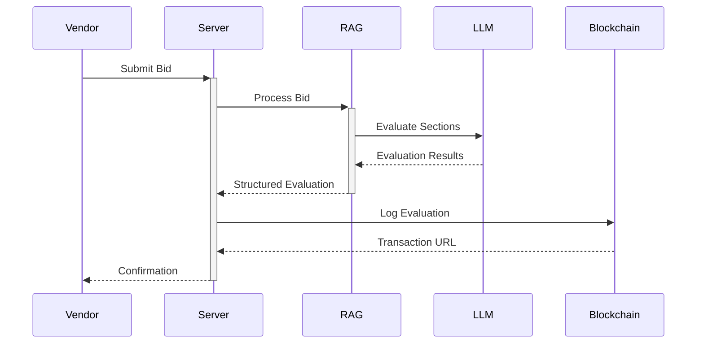

# UniSphere: AI-Powered Transparent Procurement System Architecture

## System Overview

UniSphere is a decentralized procurement platform that combines blockchain technology, artificial intelligence, and secure authentication to create a transparent and efficient procurement process. The system leverages multiple cutting-edge technologies to ensure fairness, efficiency, and accountability in the procurement lifecycle.

## Core Technologies

### 1. Blockchain Integration (Ethereum Network)
- **Network**: Sepolia Testnet
- **Smart Contracts**: 
  - `ProcurementLog.sol`: Records critical procurement events
  - Key events logged:
    - RFP Creation and Publication
    - Bid Submissions
    - Bid Evaluations
- **Transaction URLs**: Each blockchain transaction generates a verifiable URL for:
  - RFP creation (`creationTxUrl`)
  - RFP publication (`publicationTxUrl`)
  - Bid submission (`submissionTxUrl`)
  - Bid evaluation (`evaluationTxUrl`)

### 2. Large Language Models (LLM)
- **Model**: IBM Granite-13B-Instruct
- **Key Features**:
  - Open-source foundation model
  - JSON response formatting
  - Temperature control for different tasks
  - Instruction-tuned for procurement tasks
- **Configuration**:
  - Maximum input tokens: 4,096
  - Maximum output tokens: 1,024
  - Default temperature: 0.3 for focused outputs
  - Top-p sampling: 0.9

### 3. Retrieval-Augmented Generation (RAG)
- **Components**:
  - Embeddings Service (`GraniteEmbeddingService`)
    - Model: granite-embedding-30m-english
    - Dimensions: 768
    - Maximum sequence length: 512
  - Vector Store (`VectorStore`)
  - Document Processing
- **Process Flow**:
  1. Document chunking into sections
  2. Embedding creation using Granite model
  3. Vector storage and similarity search
  4. Contextual information retrieval
  5. LLM-based analysis with retrieved context
- **Batch Processing**:
  - Optimized batch size: 32 texts
  - Efficient parallel processing
  - Memory-optimized chunking

### 4. Authentication & Authorization
- **JWT Implementation**:
  - Token-based authentication
  - Role-based access control (GPO, Vendor)
  - Token expiration and refresh mechanism

## Module Architecture

### 1. Authentication Module
- **Components**:
  - `auth.controller.ts`
  - `auth.middleware.ts`
- **Features**:
  - User registration
  - Login/Logout
  - Role-based access
  - Email verification
- **Technologies**:
  - JWT
  - bcrypt
  - NodeMailer

### 2. RFP Management Module
- **Components**:
  - `rfpGeneration.service.ts`
  - `rfp.controller.ts`
- **Features**:
  - RFP Creation and Publication
  - Information Extraction
  - Category Management
- **AI Integration**:
  ```plaintext
  RFP Creation Prompt:
  "As an expert in government procurement, create a detailed RFP description..."
  ```
- **RAG Implementation**:
  1. PDF text extraction
  2. Section splitting
  3. Granite embedding creation
  4. Contextual search
  5. Information extraction

### 3. Bid Management Module
- **Components**:
  - `bidAnalysis.service.ts`
  - `bidEvaluation.service.ts`
  - `bid.controller.ts`
- **Features**:
  - Bid Submission
  - Analysis
  - Evaluation
- **AI Integration**:
  ```plaintext
  Bid Analysis Prompt:
  "As an expert in analyzing government procurement proposals..."

  Bid Evaluation Prompt:
  "As an expert procurement bid evaluator..."
  ```
- **Evaluation Metrics**:
  - Cost Effectiveness (15%)
  - Supplier Qualifications (15%)
  - Timeline (10%)
  - Project Overview (10%)
  - Management Plan (10%)
  - Product Effectiveness (10%)
  - Compliance (10%)
  - Pricing (10%)
  - Compliance Matrix (5%)
  - RFP Alignment (5%)

## Open Source Approach
- **Model Selection**:
  - IBM Granite models for transparency and customization
  - Community-driven development
  - No vendor lock-in
- **Future Enhancements**:
  - Fine-tuning on procurement data
  - Custom embedding models
  - Domain-specific optimizations
- **Research Integration**:
  - Academic procurement papers
  - Industry best practices
  - Regulatory requirements
  - Case study learnings

## User Interaction Flows

### GPO User Flow
1. **Authentication**:
   - Login with GPO credentials
   - JWT token received

2. **RFP Creation**:
   - Upload RFP document
   - AI extracts information
   - Review and publish RFP
   - Blockchain records creation and publication

3. **Bid Management**:
   - View submitted bids
   - Access AI-generated evaluations
   - Review blockchain verification

### Vendor User Flow
1. **Authentication**:
   - Login with vendor credentials
   - Verification status checked

2. **RFP Interaction**:
   - Browse published RFPs
   - Access RFP details

3. **Bid Submission**:
   - Upload proposal
   - Receive AI analysis
   - Submit final bid
   - Blockchain verification

## Technology Interaction Examples

### 1. RFP Information Extraction


### 2. Bid Evaluation


## Security and Performance Considerations

### Security
1. **Authentication**:
   - JWT expiration
   - Role verification
   - Request validation

2. **File Handling**:
   - Size limits
   - Type validation
   - Secure storage

3. **API Protection**:
   - Rate limiting
   - Input validation
   - Error handling

### Performance
1. **LLM Optimization**:
   - Token batching
   - Rate limit management
   - Response caching

2. **RAG Efficiency**:
   - Chunking strategies
   - Embedding optimization
   - Vector search performance

3. **Blockchain**:
   - Asynchronous logging
   - Transaction management
   - Gas optimization

## Future Considerations

### 1. AI Enhancements
1. **Model Improvements**
   - Custom fine-tuning
   - Domain adaptation
   - Performance optimization
   - Response quality

2. **RAG Optimization**
   - Improved chunking
   - Better context selection
   - Enhanced embedding
   - Historical learning

3. **Procurement-Specific AI Development**
   - Collaboration with procurement teams for domain expertise
   - Development of configurable evaluation metrics
   - Dynamic scoring systems based on industry standards
   - Agentic AI capabilities for autonomous evaluation
   - Integration of procurement best practices
   - Learning from historical procurement decisions

### 2. Blockchain Integration
1. **Smart Contracts**
   - Advanced features
   - Gas optimization
   - Cross-chain support
   - Automated verification

2. **Transaction Management**
   - Batch processing
   - Cost optimization
   - Speed improvements
   - Recovery mechanisms

3. **Explainable Blockchain**
   - User-friendly transaction visualization
   - Plain language explanation of blockchain records
   - Interactive timeline of procurement events
   - Visual representation of document integrity
   - Simplified verification process for non-technical users
   - Educational resources about blockchain immutability
   - Real-time verification status indicators

### 3. Research and Data Integration
1. **Procurement Research**
   - Partnership with academic institutions
   - Analysis of successful procurement patterns
   - Study of evaluation methodologies
   - Research on bias prevention in procurement
   - Development of standardized metrics

2. **Dataset Development**
   - Collection of historical procurement data
   - Curation of bid evaluation examples
   - Documentation of award decisions
   - Compilation of industry-specific requirements
   - Building evaluation criteria database

3. **Knowledge Base Enhancement**
   - Integration of procurement regulations
   - Industry-specific requirements library
   - Best practices documentation
   - Case studies of successful procurements
   - Standardized evaluation frameworks

### 4. User Experience Improvements
1. **Blockchain Visualization**
   - Interactive transaction explorer
   - Document integrity verification interface
   - Timeline-based event tracking
   - Visual proof of immutability
   - Simplified blockchain status indicators

2. **Educational Resources**
   - Blockchain concept explanations
   - Procurement process guides
   - Evaluation criteria documentation
   - Best practices tutorials
   - Interactive learning modules

3. **Transparency Features**
   - Public procurement dashboard
   - Real-time status tracking
   - Automated compliance checking
   - Decision audit trails
   - Stakeholder notification system 